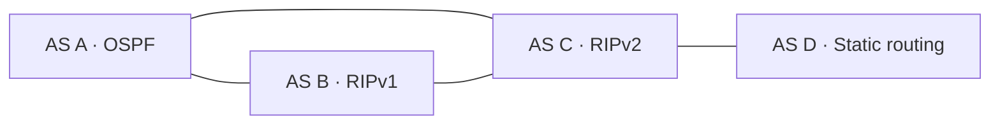

# Multi-AS Network Design and Routing Simulation

An individual academic project developed for the Network Architecture course at Universidad Pontificia Comillas (ICAI). The project covers the design, configuration and testing of a network connecting four autonomous systems in Cisco Packet Tracer, combining multiple routing protocols, VLAN segmentation and access control policies.

The main challenge was integrating networks with different internal routing schemes into a connected topology while maintaining their addressing requirements and traffic restrictions.

## Network Architecture

The network consists of four autonomous systems connected through BGP. Each uses a different internal routing approach:

| Autonomous System | Internal Routing | Main Features |
|---|---|---|
| A | OSPF | Two company networks, departmental VLANs and selective outbound traffic filtering |
| B | RIPv1 | Four interconnected LANs arranged in a router ring, with restricted external access |
| C | RIPv2 | Private addressing, wired LANs and a wireless network |
| D | Static routing | A loopback network advertised to the other autonomous systems |

The following diagram represents the BGP connections between autonomous systems:

## Technical Highlights

- **Inter-AS routing:** configured BGP sessions between border routers and advertised internal networks to provide connectivity across autonomous systems.
- **Internal routing:** combined OSPF, RIPv1, RIPv2 and static routes within a single simulated environment.
- **IP addressing:** designed subnet allocations for company networks, departmental LANs and router links.
- **VLAN segmentation:** separated four departments in AS A using VLANs, access ports, 802.1Q trunks and router subinterfaces.
- **Traffic filtering:** applied extended access control lists to restrict selected traffic according to each network's requirements.
- **Troubleshooting:** investigated addressing, routing and connectivity issues, including the constraints of classful routing with RIPv1.

## Traffic Policies

The configuration applies different access requirements across the topology:

- In **AS A**, one department is restricted to outbound HTTP and HTTPS traffic when accessing external networks, while communication between departments remains permitted.
- In **AS B**, incoming traffic from outside the company network is restricted to HTTP and Telnet, while internal communication remains unrestricted.
- In **AS C**, wired and wireless segments use private addressing. The report also discusses limitations affecting inbound connectivity to the wireless segment.

These policies demonstrate how routing and ACL placement jointly affect connectivity and application access.

## Validation

The final report documents connectivity checks using ICMP and HTTP, including:

- Communication between internal LANs and autonomous systems.
- Successful web access where permitted by the configured ACLs.
- Blocked ICMP traffic across restricted network boundaries.
- Reachability of the loopback network in AS D.

The report includes topology diagrams, addressing decisions, configuration excerpts and screenshots of the tests performed in Packet Tracer.

## Repository Contents

- **Cisco Packet Tracer project (`.pkt`):** the network topology and device configurations.
- **Final report (`.pdf`, Spanish):** the original academic submission describing the design, implementation and validation.

## Project Scope

This project was built as an academic simulation. Protocols and services such as RIPv1 and Telnet were included to meet the exercise requirements and explore their behavior, rather than as recommendations for production networks.

## Technologies

Cisco Packet Tracer · Cisco IOS CLI · BGP · OSPF · RIPv1/RIPv2 · IPv4 Subnetting · VLANs · IEEE 802.1Q · Extended ACLs

## Author

**Iñigo Martínez de la Riva Muinelo**  
Telecommunications Engineering — Universidad Pontificia Comillas (ICAI)
